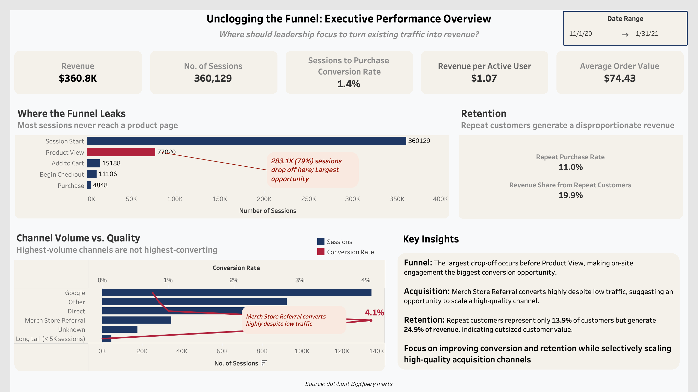

# Unclogging the Funnel — Driving Conversion, Retention, and Revenue: An End-to-End E-commerce Analytics Case Study



---

## Project Summary

A mid-sized retailer with a growing e-commerce channel has been investing in digital acquisition to increase online revenue. Although traffic and engagement have grown, revenue has not kept pace. This project investigates where the customer journey is breaking down, which acquisition channels drive high-value users, and what behaviors are associated with repeat purchase — transforming event-level behavioral data into an executive-ready analytics dashboard and set of business recommendations.

## Business Problem

Leadership is concerned that increased top-of-funnel activity is not translating into proportional revenue growth. This project identifies whether the problem is driven by weak acquisition quality, poor on-site conversion, low repeat purchase behavior, or a combination — and quantifies the highest-impact opportunity for the business to act on first.

## Core Business Question

**How should leadership prioritize improvements across acquisition, on-site conversion, and retention to drive revenue growth more efficiently?**

## Stakeholders

- **VP of Product** — user journey friction, on-site behavior, conversion opportunities
- **Director of E-commerce** — revenue performance, merchandising outcomes, digital channel health
- **Director of Growth Marketing** — acquisition quality, channel efficiency, downstream commercial impact
- **Director of Finance** *(secondary)* — growth efficiency, ROI, sustainability of e-commerce investment

---

## Key Findings

| Area | Finding |
|---|---|
| **Funnel** | **142,407 sessions (77.2%)** drop off before ever viewing a product — by far the largest leak in the funnel, dwarfing losses at cart or checkout |
| **Channel Quality** | **Merch Store Referral** converts at **4.8%** on just 19,234 sessions — several times the rate of Google, the largest-volume channel, which converts at under 1% |
| **Retention** | Repeat customers are **13.9%** of buyers but generate **24.9%** of revenue — nearly double their proportional share |

**Bottom line:** the business's biggest revenue opportunity isn't acquiring more traffic or fixing checkout — it's improving what happens the moment a session lands, reallocating acquisition spend toward already-proven high-quality channels, and protecting the small but disproportionately valuable repeat-customer base.

See the full [Executive Summary](presentation/executive_summary.md) for the complete recommendation memo.

---

## Live Dashboard

The dashboard is built in Tableau Desktop Public version, but not published to Tableau Public for interactive viewing. Instead, the workbooks in the dashboard folder are best to view.

The dashboard includes a shared date-range control (Nov 1, 2020 – Jan 31, 2021) that filters the KPI scorecard, funnel view, channel analysis, and retention metrics simultaneously.

---

## Dashboard Structure

- **Executive KPI Scorecard** — Revenue, Sessions, Session-to-Purchase Conversion Rate, Revenue per Active User, Average Order Value
- **Funnel View** — five-stage conversion funnel (Session Start → Product View → Add to Cart → Begin Checkout → Purchase) with dynamic step-over-step conversion rates and an automatically updating drop-off annotation
- **Channel Efficiency View** — dual-axis chart comparing session volume against conversion rate by acquisition channel, isolating high-quality/low-volume channels from high-volume/low-quality ones
- **Retention Snapshot** — repeat purchase rate and revenue share from returning customers, plus a new-vs-returning revenue split
- **Key Insights Panel** — decision-oriented takeaways (Convert / Optimize / Retain) summarizing what leadership should prioritize
- **Global Date Range Filter** — shared across all sections despite the dashboard using multiple independent data sources (see Technical Approach)

---

## Technical Approach

### Architecture
```

GA4 event data + synthetic enrichment tables
        ↓
  Staging models (BigQuery)
        ↓        
  Intermediate behavioral models
        ↓
  Business marts (funnel, retention, channel efficiency, executive KPIs)
        ↓
  Tableau dashboard + executive memo
  
```

### Stack
- **BigQuery** — cloud data warehousing
- **dbt** — SQL-based transformation, layered staging → intermediate → mart modeling
- **Tableau** — dashboard development, BigQuery Custom SQL connections, parameter-driven filtering
- **GitHub** — documentation and version control

### Core Data Models
- `int_sessions`, `int_funnel_events`, `int_orders`, `int_user_activity`
- `mart_funnel_performance`, `mart_retention_cohorts`, `mart_channel_efficiency`, `mart_executive_kpis`

### Supporting Enrichment Models
- `stg_ga4_events`, `stg_channel_spend`, `stg_product_margin`, `stg_support_returns`, `mart_product_performance`

### Notable Technical Decisions

**Multi-source dashboard without relational joins.** Several marts don't share a reliable join key, and some (like the executive KPI mart) are single/low-row-count summary tables that would fan-out incorrectly if joined to higher-grain tables. Rather than forcing a join or blend, each mart was connected as an independent Tableau data source.

**Cross-source global date filter via shared parameters.** Because Tableau's native filter propagation doesn't cross unrelated data sources, the dashboard uses two shared parameters (`pStartDate`, `pEndDate`). Each data source has its own calculated `Date Filter` field referencing the same parameters, letting one date-range control filter the entire dashboard despite the underlying source separation.

**BigQuery Custom SQL for chart-ready reshaping.** Several visuals (the funnel stage chart, the channel volume/quality chart) required data in a different shape than the marts naturally provide. These were built as Custom SQL connections directly against BigQuery, including CTE-based logic to correctly classify long-tail acquisition channels by lifetime volume rather than per-day volume.

**Live-computed rates over pre-aggregated ratios.** Conversion and drop-off rates are computed as live Tableau calculations (aggregate calcs or table calculations) rather than pre-computed percentage columns in SQL — pre-computed ratios summed incorrectly once a date dimension was introduced for filtering, so all rate logic was moved to compute from correctly-aggregated raw counts at query time.

---

## Metric Framework

**North-Star Metric:** Revenue per Active User (RPAU) = Total Revenue / Distinct Active Users in Period — chosen because it captures the combined effect of acquisition quality, on-site conversion, repeat purchase behavior, and monetization in a single number.

**Executive KPIs:** Revenue, Purchase Conversion Rate, Average Order Value, Repeat Purchase Rate, Estimated Gross Profit, ROAS/CAC Proxy

**Funnel Metrics:** Session-to-Product View Rate, Product View-to-Add to Cart Rate, Add to Cart-to-Begin Checkout Rate, Begin Checkout-to-Purchase Rate, Overall Session-to-Purchase Conversion Rate, Cart Abandonment Rate, Checkout Abandonment Rate

**Retention Metrics:** Repeat Purchase Rate, Average Days to Second Purchase, Revenue Share from Returning Customers, Cohort Retention by First Purchase Period

---

## Data Sources

- **GA4 public sample e-commerce dataset** (BigQuery) — primary source of event-level digital behavior
- **Synthetic channel spend table** — supports acquisition efficiency analysis
- **Synthetic product margin table** — estimates gross profit and margin contribution
- **Synthetic support/returns table** — introduces operational and customer experience guardrails

---

## Known Limitations

- Synthetic paid-channel spend data (Google CPC, Facebook remarketing, email promo) did not reliably join to real session/order data at the row level; ROAS for these channels is flagged as a data gap rather than shown as a misleading $0
- The long-tail channel bucketing threshold is calibrated against the full 3-month period; very short date-range selections may shift which channels appear in the "long tail" grouping
- One synthetic product margin row contained a negative gross profit due to a bad unit-cost value in the synthetic enrichment data — a known artifact of the synthetic tables, not a real business finding

---

## Repository Structure

```
README.md
docs/                   → architecture notes, metric dictionary, dashboard screenshots
seeds/                  → synthetic spend, margin, and support/returns tables
models/                 → staging, intermediate, and mart models
dashboard/              → Tableau workbooks (.twbx)
presentation/           → executive summary
images/                 → dashboard preview image
```

---

## Why This Project Matters

This project demonstrates the end-to-end skill set expected in analyst and analytics-focused roles:

- Product and behavioral analytics
- SQL transformation and business data modeling (dbt)
- Cloud data warehousing (BigQuery)
- BI dashboard design and development (Tableau — parameters, table calculations, dual-axis charts, dynamic annotations)
- Multi-source dashboard architecture and cross-source filtering design
- Stakeholder-oriented KPI design
- Business recommendation development and executive communication
- Debugging real analytical correctness issues (aggregation pitfalls, threshold-before-aggregation errors) — not just building charts, but ensuring the numbers behind them are right

---

## Status

**Complete.** The business problem, architecture, metric framework, dbt pipeline, and Tableau executive dashboard have all been built and validated.

---

**Author:** Ishan (Friday) Mishra
**Program:** M.S. in Information Systems Management (Business Intelligence & Data Analytics), Carnegie Mellon University
**Background:** B.S. in Information Systems and Data Science, University of Wisconsin–Madison
